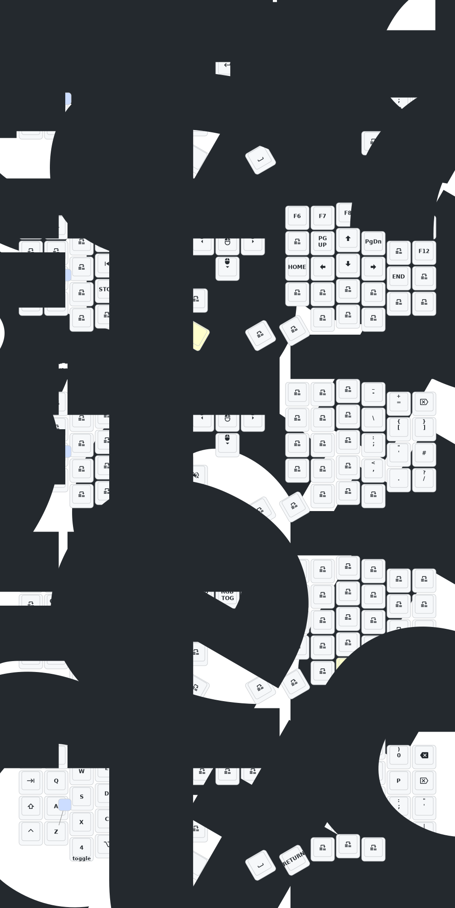

# Sofle

## Features
### Layers (by number)
0. Main alphanumeric layer with basic special characters
1. Function keys and carat nagivation keys
2. Special characters
3. MacOS specific layout

## Hardware
- Sofle layout
- [Nice!View](https://nicekeyboards.com/docs/nice-view/) screens
  - 160x68px resolution
- [NiceNano v2](https://nicekeyboards.com/nice-nano/)

## Homerow mods
Specific to my use case. SCAG - Shift, Control, Alt and Super (GUI)

# Keymap



## Regenerating the keymap SVG

To regenerate `keymap-drawer/eyelash_sofle.svg` follow these steps:

1. Install the `keymap-drawer` CLI (requires Python and pip):

```bash
pip3 install keymap-drawer
```

2. Parse the ZMK keymap into a keymap-drawer YAML file:

```bash
keymap parse -c 10 -z config/eyelash_sofle.keymap > keymap-drawer/eyelash_sofle.yaml
```

3. Draw the SVG from the generated YAML:

```bash
keymap draw keymap-drawer/eyelash_sofle.yaml > keymap-drawer/eyelash_sofle.svg
```

This will overwrite `keymap-drawer/eyelash_sofle.svg`, which is displayed above.
